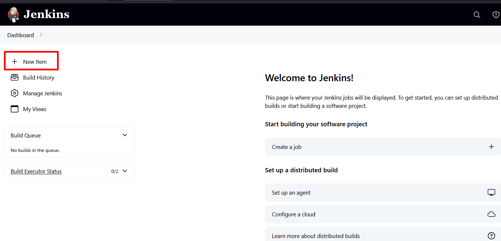
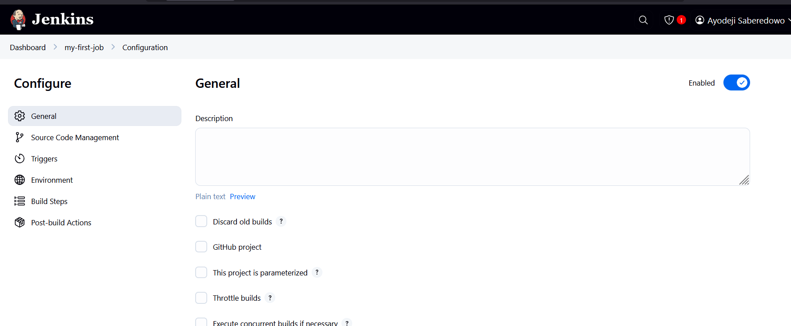
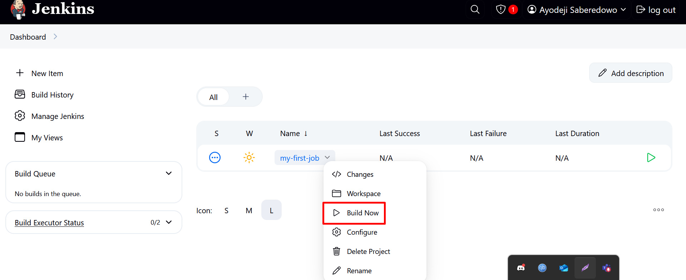
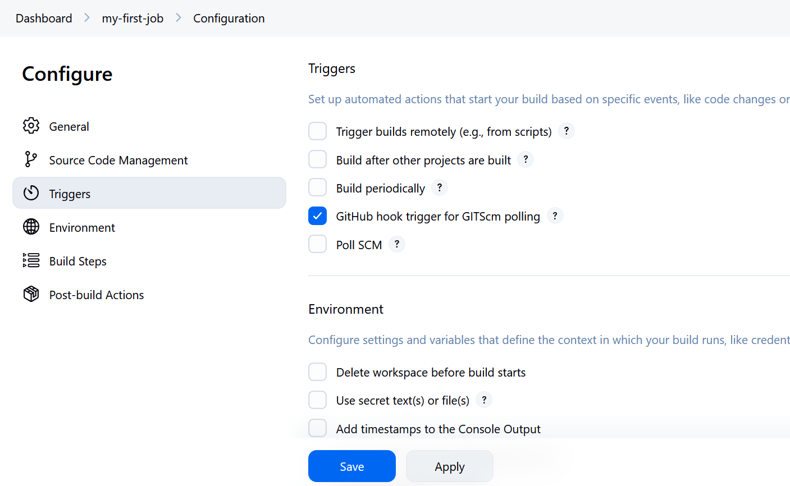

# Creating Jenkins Freestyle Project

## Step 1: Create a New Item

1. From the Jenkins dashboard menu on the left-hand side, click on **“New Item”**.

2. Choose **Freestyle Project** and give it a name.  
   For this example, I’ll call mine: **`my-first-job`**.

---

## Step 2: Connecting Jenkins to GitHub

Now that the freestyle project is ready, let’s link it to GitHub so Jenkins can work directly with the repository.

1. Head over to GitHub and create a new repository called **`jenkins-scm`**.  
   Make sure you include a simple `README.md` file when creating it.
2. Back in Jenkins, open your project’s configuration and paste your repository URL into the **Source Code Management** section.  
   Make sure your branch is set to **main**.
3. Click **Save**, then hit **Build Now** to make sure Jenkins can successfully pull from your repository.

Great! 🎉 At this point, Jenkins is officially connected to your GitHub repo **(jenkins-scm)**.

---

## Step 3: Adding a Build Trigger (Automation)

Right now, every time we want a new build, we have to manually click **Build Now**.  
But we’re engineers – let’s automate this!  
With a build trigger, Jenkins will automatically start a build whenever we push changes to GitHub.

Here’s how we’ll do it:

1. Open your project settings by clicking **Configure**.
2. Scroll down to **Build Triggers** and enable the option to **Trigger builds from GitHub webhook**.

3. On GitHub, create a **Webhook** and point it to your Jenkins server’s IP address (and port).

---

Now, let’s test it out:

- Make a simple change in your GitHub repository (for example, update your `README.md` file).
- Push the change to the **main** branch.
- Jenkins should automatically start a new build for you – no clicking required!

---

That’s it!  
We’ve set up our first Jenkins freestyle project, connected it to GitHub, and automated the build process with a webhook. 🚀
